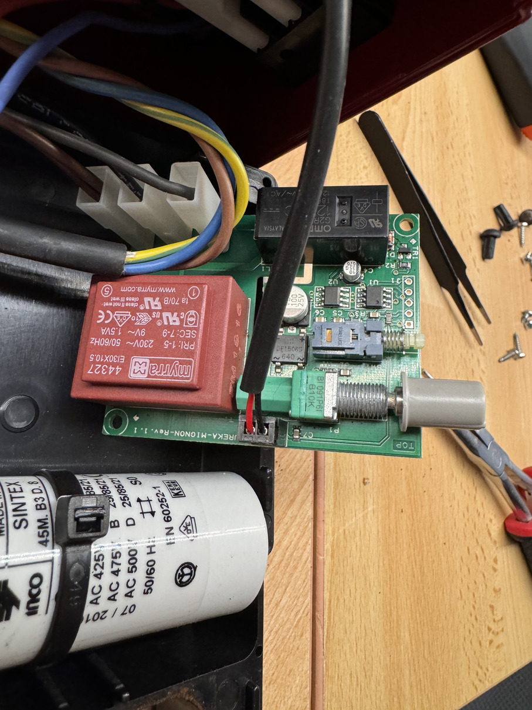
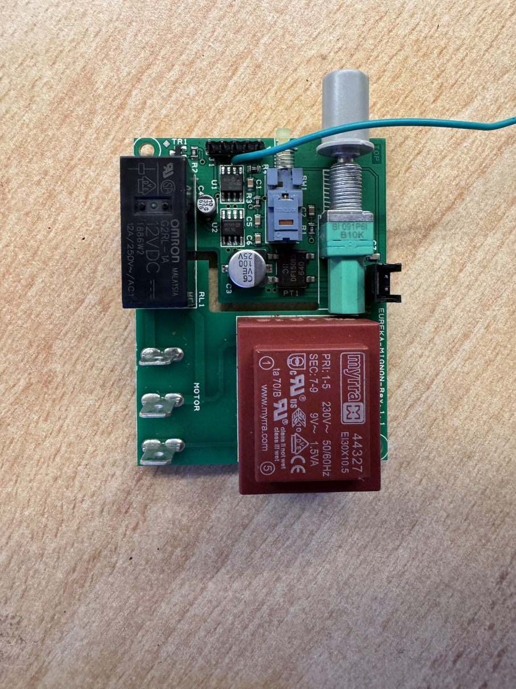
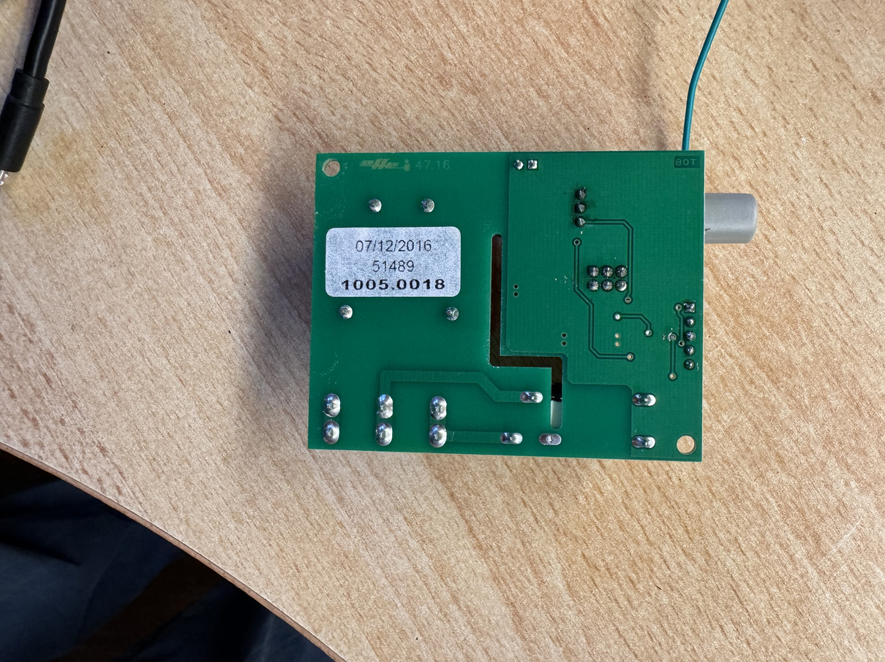
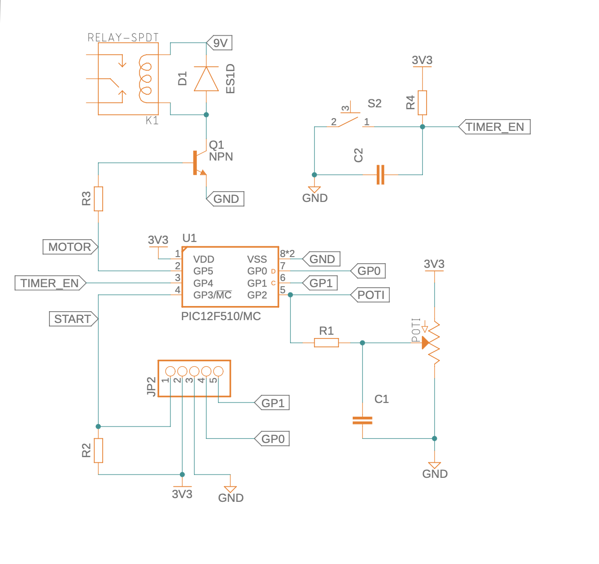
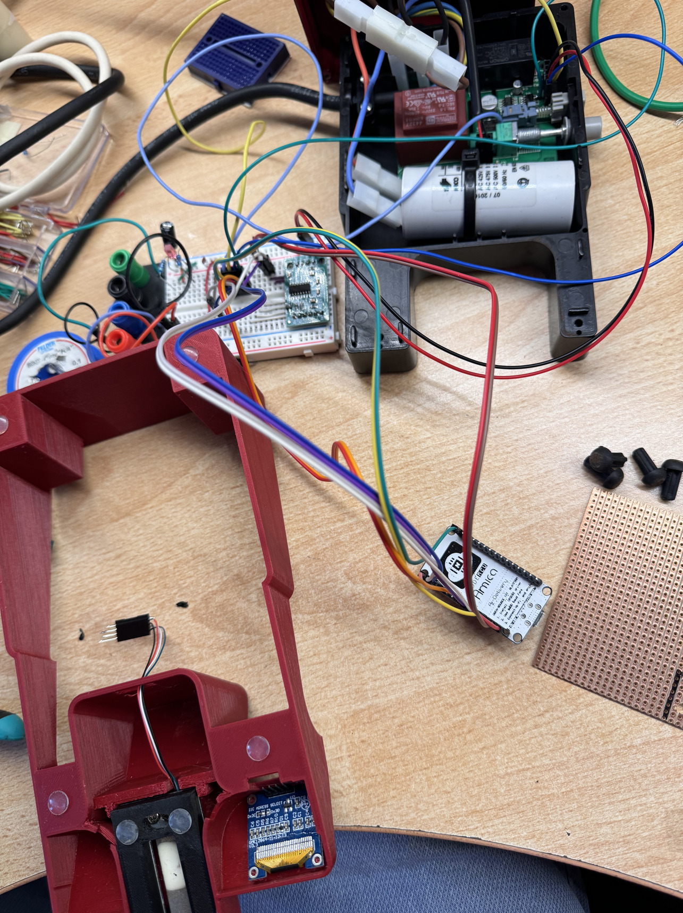
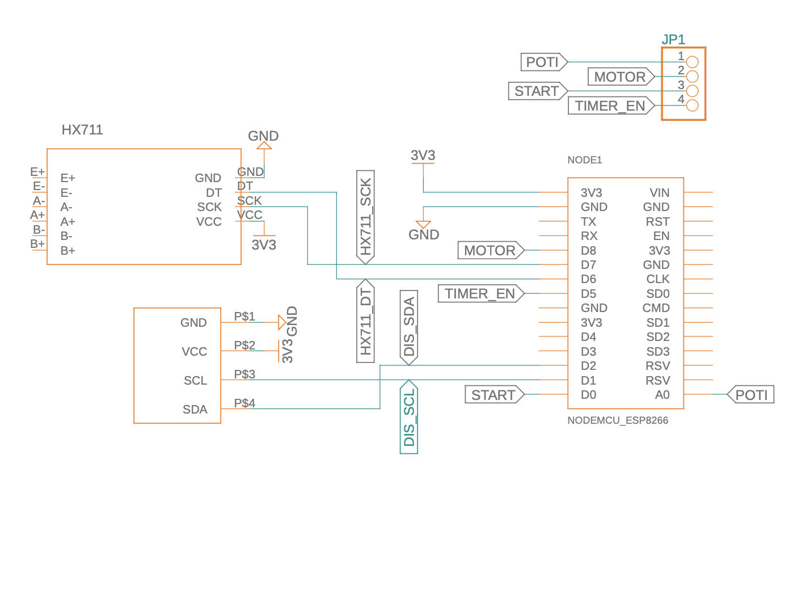

# Grind By Weight for Eureka MCI coffee grinder

  

This project is based on [the work by Guillaume Besson](https://besson.co/projects/coffee-grinder-smart-scale). I modified it to work with my slightly different grinder and a single core ESP8266 instead of a multi-core ESP32 and added some features to the software

Bill of Material:
-----------------

- Loadcell (mine was 50x10x6mm up to 500g)
- HX711 Load Cell amplifier
- ESP8266 Dev-Board
- 0.96 inch OLED SSD1306 Display
- 4 Cylinder Magnets (6mmx6mm)
- 3D-Printed Parts

### Original electronics of the Eureca MCI

The original electronics slightly differ from the one used bt Guillaume. Mostly the microcontroller operates on a 3.3V instead of 5V. Also, most useful in and outputs where not conviniently accessible via a pinheader.

*Original PCB in-situ*

*Original PCB front side*

*Original PCB back side*

So the first step was revers-engineering the pcb layout

*simplified schema of the original MCI pcb*

Most of the electronics where straight forward. I wired the HX711 and loadcell, as well as the oled-screen as required to the ESP-8266 DEV-Board. I took the 3.3V supply from the machine, added two caps for good measure to stabilize the voltage for the esp (which seems to be quite a bit more picky then the pic)
The original electronics board contains a transformer to generate 9V AC, which is then fed to a rectifier and a 3.3V regulator for the tiny PIC12 mcu which controls the machine.

*the usual chaotic electronics-project*

Interfacing with the old electronics was where I first realized that this might become a bit more of a project.

Directly triggering the relay by setting the `MOTOR` pin high would sink a lot of current into the pic12 microcontroller, which would try to keep it's output low. This would risk damaging the microcontroller at least in the long run.

I could have built a second npn controlled output, directly connected to the 9V supply, but this would mean two more components to solder.

So I opted for just reusing the existing `START` pin of the pic12 and let the original mcu trigger the relay.

This had the effect, that when the timer-enabled switch was turned on, the new mcu wouldn't be able to shut down the grinding process, but I decided to make this a feature instead of a bug.

Thats when I realized i could make use of the existing input-devices provided by the machine. The push-button, to switch between modes, and the potentiometer to select grind-amount. I could sense the state of both, then use the potentiometer position to set the desired weight OR time to grind.

In timing mode, the new mcu would just let the old one make it's job as before, but additionally provide feedback to the user for the grind-time. Something that previously only could be roughly adjusted.

In wight mode, a desired amount of ground coffee is selected with the potentiometer, and the new mcu will hold the 'START' input of the old high until the requested amount is reached

In the end, this is the new electronics-parts I added to the machine

*Schema of additional electronics added for this project*
